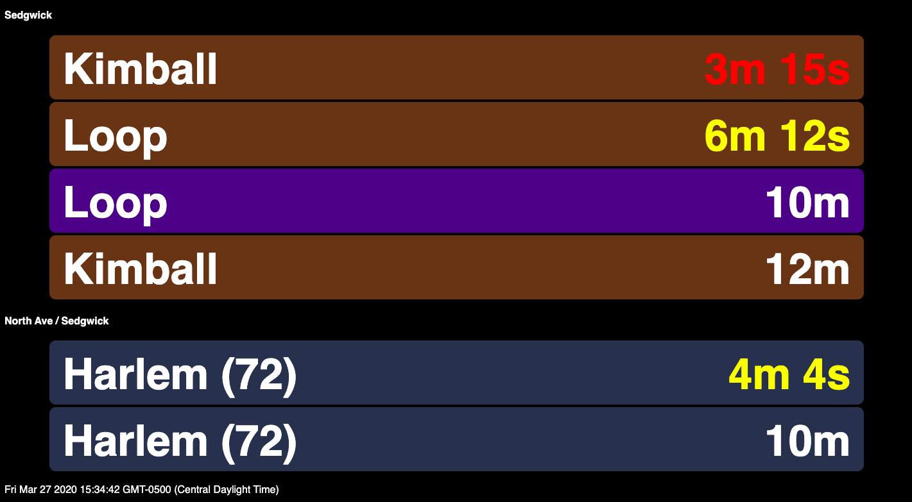

# transit-tracker
Custom train and bus tracker utilizing the Chicago Transit Authority API's. <br>

Times are color-coded to represent which trains can be made when incorporating
door-to-door time walk time.



## API Reference:
CTA Train Tracker API: https://www.transitchicago.com/developers/traintracker/ <br>
CTA Bus Tracker API: https://www.transitchicago.com/developers/bustracker/

## Sample config.txt File
```
[Credentials]
train_key = foo
bus_key = bar

[Threshold Times]
train_yellow = 420000
train_red = 240000
bus_yellow = 360000
bus_red = 180000
```
The credentials section contains API keys obtained from the CTA Developer Portal.

Threshold times represent the respective times (in milliseconds) when the countdown
timers will change color.

## Getting Started
```
export FLASK_APP=transit-tracker.py
flask run
```
